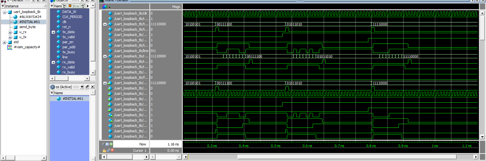

# Full-Duplex UART

A full-duplex UART (Universal Asynchronous Receiver/Transmitter) implemented in SystemVerilog, capable of serializing and deserializing 8-bit data with optional even/odd parity. Verified in ModelSim using a self-checking loopback testbench.

**Author:** Martin Mounir Fayez

---

## Overview

The design is split into a transmit (TX) datapath and a receive (RX) datapath, each driven by its own finite state machine. TX serializes an 8-bit input word, optionally computes and appends a parity bit, and drives it out one bit per clock. RX detects the incoming start bit, deserializes the frame, and re-checks parity to flag errors.

## Module structure

**Transmit path**
| Module | Role |
|---|---|
| `uart_tx.sv` | Top-level TX module, connects the blocks below |
| `fsm.sv` | Sequences START → DATA → PARITY → STOP and drives the output mux select |
| `Serializer.sv` | Shifts the 8-bit input out one bit per clock |
| `Parity_bit_calc.sv` | Computes even/odd parity over the input byte |
| `mux.sv` | Selects start bit / data bit / parity bit / stop bit onto the TX line |

**Receive path**
| Module | Role |
|---|---|
| `uart_rx.sv` | Top-level RX module, connects the blocks below |
| `edge_detector.sv` | Detects the falling edge that marks the start bit |
| `fsm_rx.sv` | Sequences DATA → PARITY → STOP in step with the incoming line |
| `deserializer.sv` | Shifts incoming bits into an 8-bit parallel register |
| `parity_check.sv` | Recomputes parity on the received byte and flags a mismatch |

**Verification**
| File | Role |
|---|---|
| `uart_loopback_tb.sv` | Loopback testbench: ties TX output to RX input and drives test bytes through with parity on and off |

## How it works

One clock cycle = one bit period (no separate baud-rate generator in this version). A frame on the wire looks like:

```
START | D0 D1 D2 D3 D4 D5 D6 D7 | (PARITY) | STOP
```

The parity bit is only present when `i_par_en` is asserted; `i_par_odd` selects even (0) or odd (1) parity.

## Running the simulation (ModelSim)

```tcl
vlib work
vmap work work

vlog -sv Serializer.sv FSM.sv mux.sv Parity_bit_calc.sv edge_detector.sv deserializer.sv Parity_check.sv FSM_rx.sv uart_tx.sv uart_rx.sv uart_loopback_tb.sv

vsim -voptargs=+acc uart_loopback_tb
add wave -r /*
run -all
```

> Keep the project in a short local path (e.g. `C:\uart\`) outside of OneDrive — long/cloud-synced paths can cause `vlog` to fail on this older ModelSim toolchain.

## Verification result

The loopback testbench sends four bytes through the full TX → RX chain:

| Byte | Binary | Parity mode |
|---|---|---|
| `0xA5` | `1010 0101` | Disabled |
| `0x3C` | `0011 1100` | Disabled |
| `0x5A` | `0101 1010` | Even |
| `0xF0` | `1111 0000` | Odd |

`rx_data` matches `tx_data` bit-for-bit for every frame, confirming correct serialization, parity generation, parity checking, and deserialization end to end.



## Report

A full write-up with architecture details and annotated waveforms is included as [`UART_Project_Report.pdf`](UART_Project_Report.pdf).

## Possible extensions

- Add a baud-rate generator for true asynchronous (non-1:1) clock/bit timing
- Add framing-error detection (invalid stop bit)
- Parameterize frame width beyond 8 bits
